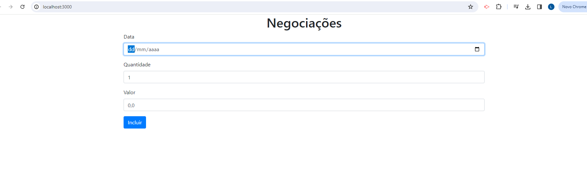

# estudo-typeScript

## Tecnologias e Versões
    1. Vs Code
    2. Node 10.21.0
    3. TypeScript 4.2.2

## Primeiros Passos

O commit inicial desse repositório contém a versão básica fornecida pelo curso para que possamos desenvolver os ensinamentos. O primeiro passo será executar o  npm install para baixar as dependências.  Depois executamos npm run server: 



## Resumo teórico

Na estrutura de um projeto utilizando typescript, a pasta dist será compartilhada com o navegador, tudo que está dentro dela será acessível ao navegador por meio de um servidor web. Como ela só entende arquivos Javascript, todo o código TypeScript ficará na pasta app e posteriormente compilado (traduzido para Javascript) e o código Javascript resultante irá para a pasta dist. Existe um script no “package.json” para “subir” o servidor e compartilhar essa pasta com o navegador. O fluxo de execução inicia através no arquivo “index.html” localizado dentro da pasta dist. Para carregarmos um módulo devemos inserir o seguinte código dentro do “<body>”:
```
    <script type="module" src="js/app.js"></script>
``` 

### Motivação TypeScript x JavaScript
No Javascript ao declarar uma propriedade do tipo privada e logo após tentarmos mutar o valor dessa propriedade em outro ponto do código, veremos que o valor não será modificado, porém será criada uma propriedade dinamicamente de mesmo nome e com o novo valor (isso só será visível em tempo de execução). A primeira motivação do TypeScript é exatamente isso, indicar em tempo de desenvolvimento a ocorrência de falhas, defeitos ou erros cometidos no código. Nesse caso, mutar o valor de uma propriedade privada é um erro no desenvolvimento e adicionar uma propriedade dinamicamente não é o comportamento que nos trás benefícios.


## Exercícios PT.1

### Branch carregando-modulo

1) Criação implícita de variáveis e falha na lógica aparecendo apenas em tempo de execução

### Branch feature/aula2
2) Baixando typeScript, configurando compilador com erros aparecendo em tempo de desenvolvimento, gerando arquivos js na compilação, configurando compilador para não gerar arquivos js em caso de falha de compilação: aula2-ex1;
3) Automatizando compilação de arquivos: aula2-ex2;
4) Declarando propriedades privadas com modificadores do TypeScript: aula2-ex3;

### Branch feature/aula3
5) Integrando ao formulário: aula3-ex1;
6) Preenchendo Modelo : aula3-ex2;
7) Substituindo tipo implícito any e convertendo para date/number: aula3-ex3;
8) Limpando formulário e alterando foco para data no fim da inclusão: ex5;

### Branch feature/aula4
9) Criando modelo lista de negociacoes: ex1
10) Integrando modelo de lista de negociacoes com a controller: ex2
11) Problema do ".pop" na lista de negociações: ex4
12) Resolvendo problema acima, evitando mutabilidade da lista: ex4
13) Resolvendo o problema acima com ReadOnlyArray: ex5
