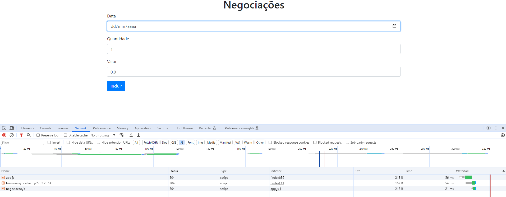

# estudo-typeScript

## Tecnologias e Versões
    1. Vs Code
    2. Node 10.21.0
    3. TypeScript 4.2.2

## Primeiros Passos

O commit inicial desse repositório contém a versão básica fornecida pelo curso para que possamos desenvolver os ensinamentos. O primeiro passo será executar o  npm install para baixar as dependências.  Depois executamos npm run server: 

1) Carregamento de módulo: branch feature/carregando-modulo - aula1-ex1
2) Criando modulo Negociacao e importando no app.js: : branch feature/carregando-modulo - aula1-ex2: 

3) 

